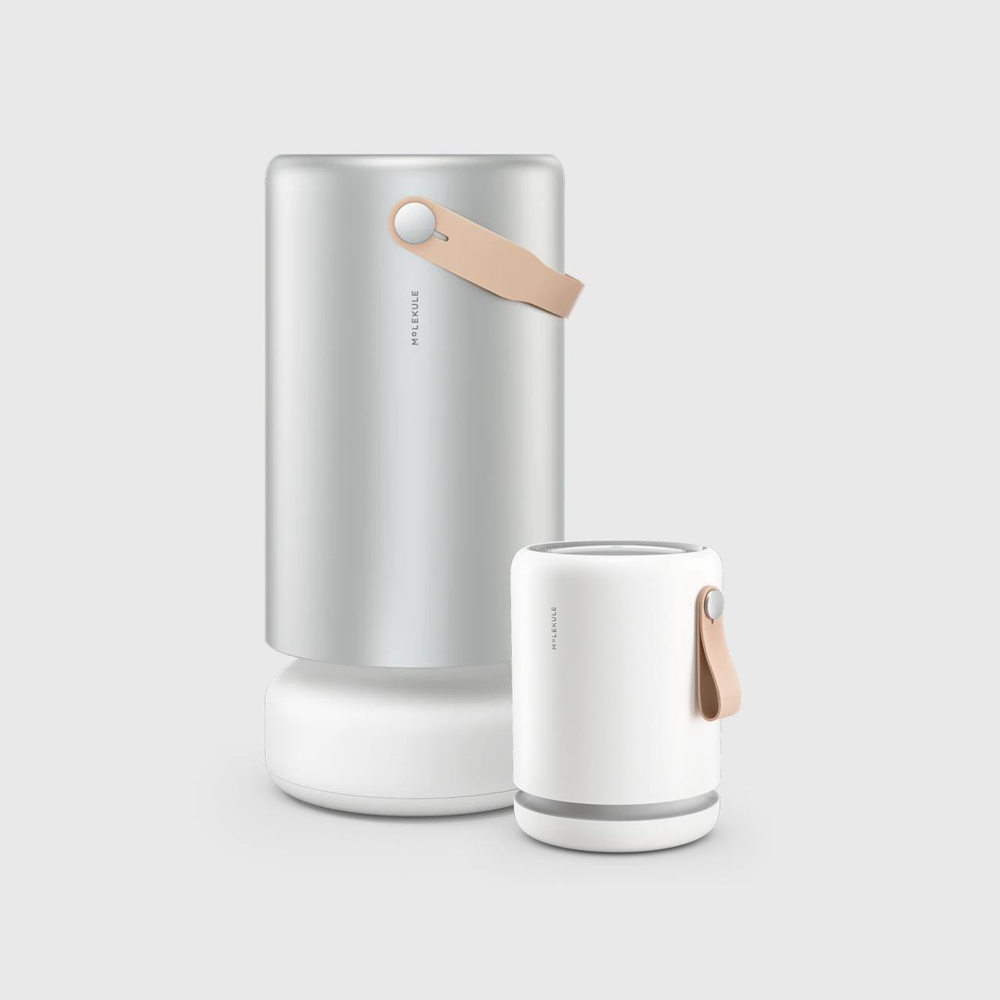

<!-- Once verified, add:
<a href="https://github.com/homebridge/homebridge/wiki/Verified-Plugins"></a>
-->

**A Homebridge plugin for Molekule air purifiers.**

Exposes your Molekule devices to Apple HomeKit — power, fan speed, Auto (smart) mode, filter life, and air-quality readings — so you can control and automate them from the Home app and Siri:

## Supported Devices



| Device | Fan speeds | Auto / Smart | Air-quality sensors |
| --- | --- | --- | --- |
| Molekule Air | 3 | — | — |
| Air Mini / Air Mini Basic | 5 | — | — |
| Air Mini Pro (Air Mini+) | 5 | ✅ | PM2.5 |
| Air Pro (Sequoia) | 6 | ✅ (+ Quiet) | PM2.5, PM10, VOC, CO₂, Humidity |

Names are pulled from the Molekule app. Unknown models fall back to sensible defaults (6 speeds, no auto/sensors).

## Installation

Search for **Molekule** under Plugins in the Homebridge UI, or install from a terminal:

```bash
npm install -g @qandnotu/homebridge-molekule
```

## Requirements

- **Node.js** 22 or 24
- **Homebridge** v1.8.0+ or v2
- A **Molekule account** (the email/password you use in the Molekule app)

## Configuration

Configure via the Homebridge UI (recommended), or add a platform block to `config.json`:

```json
{
  "platform": "Molekule",
  "name": "homebridge-molekule",
  "email": "YOUR EMAIL HERE",
  "password": "YOUR PASSWORD HERE",
  "threshold": 10,
  "excludeAirMiniPlus": false,
  "silentAuto": false,
  "quietMode": false,
  "co2Threshold": 1000,
  "pollInterval": 30
}
```

### Configuration Options

| Option | Default | Description |
| --- | --- | --- |
| `email` / `password` | — | Your Molekule account credentials (required). |
| `threshold` | `10` | Filter-life % at or below which HomeKit shows a **Change Filter** warning. |
| `excludeAirMiniPlus` | `false` | Skip Air Mini+ devices so you can use their built-in HomeKit support instead. |
| `silentAuto` | `false` | Default only: when a device is switched to Auto **from its purifier tile**, start in Quiet vs Standard (Air Pro). |
| `quietMode` | `false` | Add a **Quiet Mode** switch (Air Pro) — a live toggle for Quiet (silent) auto. |
| `co2Threshold` | `1000` | CO₂ level (ppm) above which the CO₂ sensor reports a detected/abnormal state. |
| `pollInterval` | `30` | How often (seconds) device state is refreshed from the Molekule API. HomeKit changes apply instantly; this governs how fast changes made elsewhere show up. |

> ⚠️ Use the correct password — repeated failed logins can require a full Molekule password reset.

## Usage & Controls

Each device appears as an **Air Purifier** accessory with, depending on the model:

- **On/Off**, and **Auto ↔ Manual** (Auto uses the device's smart mode)
- **Fan speed** — the slider snaps to the device's real speeds
- **Filter life** and a **Change Filter** indicator (linked FilterMaintenance service)
- **Air quality** — Air Quality, PM2.5/PM10/VOC on an Air Quality sensor
- **CO₂** — a dedicated CO₂ sensor with a detected/normal alarm (Air Pro)
- **Humidity** — a Humidity sensor (Air Pro)
- **Quiet Mode** — optional switch (Air Pro, when `quietMode` is enabled)

The air-quality, CO₂, humidity, and Quiet services live on the purifier accessory so they move with it. In the Home app you can **Ungroup** the accessory to show each as its own tile while keeping them linked.

## Device Management

Devices are discovered automatically from your Molekule account — no manual pairing. Adding or removing a device in the Molekule app is reflected on the next restart. Set `excludeAirMiniPlus` to omit HomeKit-capable Air Mini+ units.

## Recommended Usage

- Run the plugin in a **child bridge** (Homebridge UI → plugin → Bridge Settings) to isolate it from your main bridge.
- Leave `pollInterval` at 30s unless you need faster reflection of changes made outside HomeKit.
- **Ungroup** the accessory in the Home app if you prefer separate tiles for the sensors and Quiet switch.

## Troubleshooting

**Authentication issues** — Double-check the email/password used by the Molekule app. Repeated failures can lock the account until you reset the password. The plugin won't start until credentials are configured.

**Device not appearing** — Confirm the device shows in the Molekule app and is online, then restart Homebridge. Check that `excludeAirMiniPlus` isn't hiding it.

**Firmware or model shows an old value** — HomeKit caches Accessory Information; restart your Home hub (Apple TV/HomePod), or remove and re-add the accessory to refresh it.

**Connectivity issues** — If a device reports offline, its sensors show a fault status in HomeKit until it reconnects.

## Support

Please open an issue on [GitHub Issues](https://github.com/QandnotU/homebridge-molekule/issues).

## Credits

A fork of [csirikak/homebridge-molekule](https://github.com/csirikak/homebridge-molekule), updated for Homebridge 2.0 with additional features and fixes. Not affiliated with or endorsed by Molekule.

## License

Released into the public domain under the [Unlicense](LICENSE).
